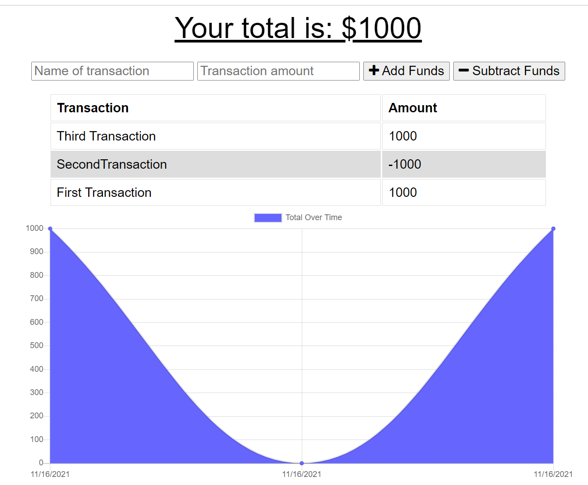

# Track-Your-Budget

  [Deployed Site](https://protected-eyrie-17990.herokuapp.com/)

  [Project Repo](https://github.com/Cleggatron/Track-Your-Budget)
  
  

  ## Description

  The idea for this project was to take an existing codebase and refactor it so that it utilised caching and indexedDB to provide offline support, (in the manner of a progressive web application). Here we are using a budget tracking app, which would allow someone to keep track of of their budget even without internet access, due to the utilisation of the cache and indexedDB

  ## Table Of Contents

  - [Installation](#installation)
  - [Usage](#usage)
  - [Credits](#credits)
  - [License](#license)
  - [Questions](#questions)

  ## Installation

  Once the repo has been cloned you would need to install dependencies with `npm i`. After this you can start it running locally with `npm start`. The project uses MongoDB, so you will also need this installed on your machine if being run locally. Alternatively if you were hosting online you would need to provision a database. If running locally then the project will be available on localhost:3000

  ## Usage

  

  Once on the site the actual functionality is fairly simple. All you need to do is name the tranaction and set an amount. Then click add funds if this is a credit to your budget, or subtract funds if it is a debit.

  ## Credits

  Other Contributors: 
  N/A

  Third Party Technologies:
  The Third Party Code used:
 - Webpack

  ## License
  MIT License

  [License Link](https://opensource.org/licenses/MIT)

  Copyright <2021> <David Clegg>

      Permission is hereby granted, free of charge, to any person obtaining a copy of this software and associated documentation files (the "Software"), to deal in the Software without restriction, including without limitation the rights to use, copy, modify, merge, publish, distribute, sublicense, and/or sell copies of the Software, and to permit persons to whom the Software is furnished to do so, subject to the following conditions:
      
      The above copyright notice and this permission notice shall be included in all copies or substantial portions of the Software.
      
      THE SOFTWARE IS PROVIDED "AS IS", WITHOUT WARRANTY OF ANY KIND, EXPRESS OR IMPLIED, INCLUDING BUT NOT LIMITED TO THE WARRANTIES OF MERCHANTABILITY, FITNESS FOR A PARTICULAR PURPOSE AND NONINFRINGEMENT. IN NO EVENT SHALL THE AUTHORS OR COPYRIGHT HOLDERS BE LIABLE FOR ANY CLAIM, DAMAGES OR OTHER LIABILITY, WHETHER IN AN ACTION OF CONTRACT, TORT OR OTHERWISE, ARISING FROM, OUT OF OR IN CONNECTION WITH THE SOFTWARE OR THE USE OR OTHER DEALINGS IN THE SOFTWARE.  

  ## Questions

  If you have any questions you can contact me at the below email address:
  david.robert.clegg@gmail.com

  You can also find me at my Github:
  [Github Profile](https://github.com/Cleggatron)

